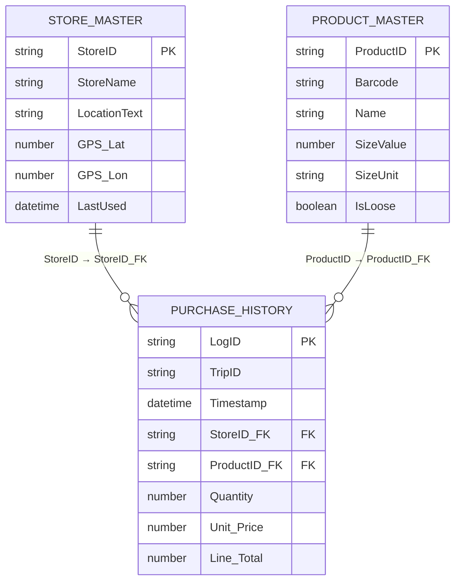

# Google Sheets Data Model (ERD)

This project uses three Google Sheets tabs as a lightweight database. The diagram below shows their relationships and key fields.

## Table Details

- **Store_Master**: One row per store, including optional GPS coordinates and last-used timestamp for recency tracking.
- **Product_Master**: One row per product or barcode; supports loose items via `IsLoose` and size metadata.
- **Purchase_History**: Transaction line items keyed by `LogID`, referencing stores and products while storing quantities and pricing for each purchase event.

The sheet headers originate from `SHEET_CONFIG` in `backend/Code.gs`, which seeds tabs and validates the expected schema during sync operations.【F:backend/Code.gs†L1-L40】
