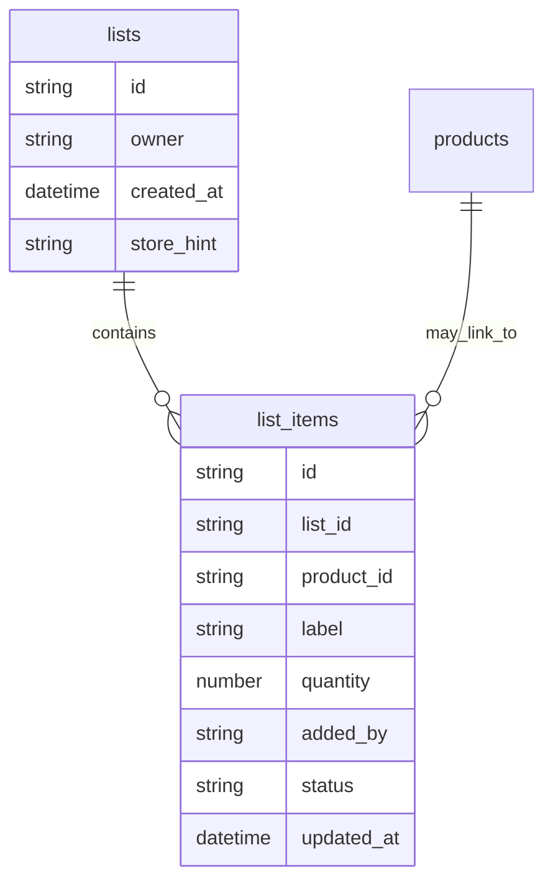
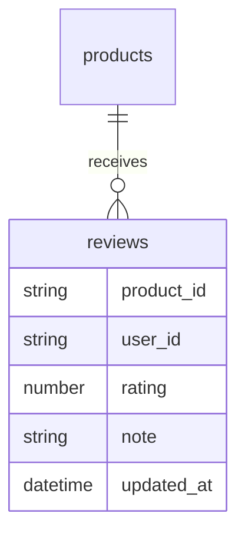

# Usage workshop: observations, pain points, and future opportunities

## Current flow recap
Users typically open the app at the start of a trip, pick a store (sorted by proximity), log items as they add them to the cart (scanning when possible), and watch a running total of expected spend.

## Observed behaviors and pain points
- **Covers more than groceries:** Also used for coffee, ice cream, restaurants, liquor stores, and other non-supermarket purchases.
- **Loose items confusion:** Shoppers are unsure whether to enter per-unit or total price when logging items like produce.
- **Cumbersome data entry:** Works end-to-end but can feel tedious, especially for repeat orders.
- **Single-user reality (for now):** Primarily a personal tool, occasionally shared with a delegate; collaboration and logins are future concerns.

## Opportunity areas and feature concepts
### 1) Streamline non-grocery items (coffee, restaurants, treats)
- **Category-aware presets:** "Coffee" with size + milk modifiers, "Ice cream" with scoops/flavors, etc., to avoid full freeform text.
- **Quick combos/favorites:** One-tap recall of past orders ("Large flat white", "Double-scoop chocolate chip").
- **Price memory by venue:** Returning to the same café pre-fills likely prices.

### 2) Clarify loose items workflow
- Label price input as **per-unit** when loose toggle is on, with a secondary readout of **computed total** (qty × unit price).
- Provide a **"switch to total" control** that back-calculates unit price.
- Show **inline examples** (e.g., "5 apples at $1.00 each → $5.00 total") and validation to flag mismatches.

### 3) Shopping list mode (low priority but high impact)
- Treat as a first-class planning mode that coexists with trip logging: plan at home, execute in-store, reconcile after checkout.
- **Add/remove flows:** free-text box with autosuggest from history, quick-add staples (rice, oil, TP, coffee), barcode add using the existing scanner, and "add from recent purchases" shortcuts.
- **Views:**
  - Plan view grouped by preferred/best-price store with quick-add chips for staples.
  - In-store checklist showing remaining items, optionally sorted by aisle/section.
  - Completed items for quick re-add.
- **Sync and collaboration:** Start single-user with offline tolerance and periodic sync; future path to multi-device sharing with simple conflict rules (last-writer-wins for check/uncheck, merge additions).
- **Price guidance:** Show recent lowest unit price per store for known products to guide where to shop.
- **Stretch analytics:** price fluctuation charts, cross-store comparisons, and simple clustering/tags for "equivalent" products (e.g., any 1kg long-grain rice).

#### Shopping list ERD (proposed)

### 4) Reduce overall friction and increase confidence
- **Smart defaults:** prioritize nearby stores (already sorted), common categories, and default quantities to minimize taps.
- **Batch entry modes:** keyboard-focused forms and rapid barcode scanning before reviewing totals.
- **Feedback/undo:** clearer success states after adding items and lightweight undo for corrections.
- **Tutorials/tooltips:** contextual hints for loose items and first barcode scans with a “dismiss forever” option.

### 5) Lightweight product reviews (new)
- **Problem to solve:** Occasionally need to remember which SKUs are great vs. terrible (e.g., a bad canned tuna brand) without bloating the main flow.
- **Experience:**
  - Optional **star rating** (MUI Rating) and short **text note** on a product detail sheet or after scanning.
  - Show the latest personal rating/note inline during price review or when adding to cart, to avoid repeat mistakes.
  - Keep entirely personal for now; no public sharing.
- **Data/Sync:**
  - Store rating (1–5) + optional comment per product per user with timestamps.
  - Append-only writes with “last updated” field; cached locally with periodic push/pull to avoid slowing trips.
- **Guardrails:**
  - Keep inputs minimal and skippable; no extra required steps during checkout.
  - Allow quick edit/clear in case opinions change.

#### Reviews ERD (proposed)

## Research and validation approach
- Self-observation/journaling during real trips (groceries, cafés, restaurants) to log friction points.
- Qualitative trials of per-unit vs. total-first flows (no A/B testing) to keep prototypes predictable.
- Track café/restaurant scenarios to find the minimal fields needed for trustworthy totals.

## Metrics to capture
- **Improve the app:** error states, retries, save failures, sync latency, and time spent per screen.
- **Understand shopping and spending:** per-visit spend, category totals, price drift by item, and impulse vs. planned list items.
- **Personal usage patterns:** session length, trip cadence, undo/edit rates, and reuse rate of presets/favorites.
- **List effectiveness:** add method mix (text vs. quick-add vs. barcode), checkoff rate and time-to-checkoff, carryover items between trips, and price-hint engagement.
- **Future shared purchases:** if expanded to flatmates, log shared-item frequency, split attribution, and conflict/override rates to guide any future login/ACL design.
- **Review usage:** how often ratings/notes are created or updated, and whether they change purchase decisions (e.g., skipping poorly rated SKUs).

## Delivery slices to avoid scope creep
1) **Friction fixes:** loose-item clarity, success/undo feedback, and guided presets for non-grocery flows.
2) **Shopping list MVP:** solo-user, offline-tolerant list with text + staples quick-add, check/uncheck, local persistence, and periodic sync to Sheets.
3) **Capture enhancements:** barcode-to-list, autosuggest from history, and “add from recent purchases.”
4) **Guidance:** best-store hints for list items, aisle/section ordering if available, and price memory by venue.
5) **Reviews:** optional per-product star rating + notes surfaced during add/price review, cached locally and synced in batches.
6) **Collaboration and stretch analytics:** multi-device sharing with simple conflicts; price fluctuation and cross-store comparisons; product equivalence tagging.

## Data model sketch (Sheets-friendly first pass)
- **list_items**: id, list_id, product_id?, label, quantity, added_by, status, updated_at.
- **lists**: id, owner, created_at, optional store_hint.
- **reviews**: product_id, user_id (single-user for now), rating (1–5), note, updated_at.
- **helpers/derived:** staples = top-N frequent items; best-store suggestion = min recent unit price per store for a product; product tags/categories for equivalence.

## Developer ergonomics
- **Centralize Google Apps Script wiring:** keep GAS Web App URLs, IDs, and related endpoints in a single configuration file (or `.env`-driven mapping) so updates to the script only require changing one location instead of touching multiple modules.
